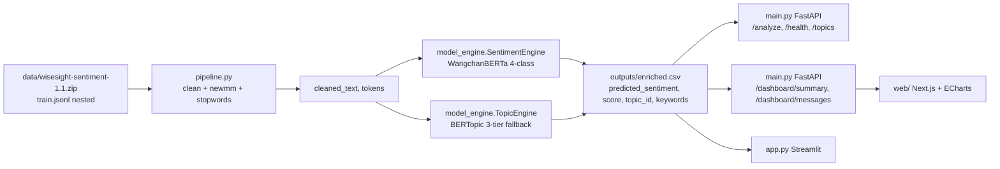

# Wisesight Thai Sentiment & Topic Analyzer

End-to-end Thai NLP system: **PyThaiNLP preprocessing → WangchanBERTa sentiment (4-class) → BERTopic modeling → FastAPI + dashboards (Streamlit and Next.js + ECharts)**.

> Live demo: _(deploy `app.py` to Streamlit Community Cloud or `web/` to Vercel / Hugging Face Spaces, then paste the link here)_

## Features

- Thai text cleaning + `newmm` tokenization + stopword removal (PyThaiNLP), reading `train.jsonl` straight from the zip (nested `huggingface/data.zip`) with no disk extraction.
- 4-class sentiment (`pos` / `neg` / `neu` / `q`) via official fine-tuned WangchanBERTa, with hybrid rule fallback for 3-label community models and pure rule-based fallback when no model/GPU is available.
- Topic modeling with a 3-tier fallback: BERTopic → TF-IDF/KMeans → keyword rules. Short text (`< 2` chars) → `neu 0.0`, topic `-1` (per `SKILL.md`).
- FastAPI backend (`POST /analyze`, `GET /health`, `GET /topics`, `GET /dashboard/summary`, `GET /dashboard/messages`).
- Two dashboards over the same data: Streamlit (`app.py`) and Next.js + Tailwind + ECharts (`web/`).
- 19 pytest tests, Dockerfile + docker-compose for all three services.

## Architecture



Fallback chains (the system stays usable without GPU / without models):

- Sentiment: `official finetuned (4-class) → community 3-class + rule-q → rule-based`.
- Topic: `BERTopic → TF-IDF/KMeans → keyword rules`.

## Key Metrics (measured, 2,000 samples)

| Metric | Value |
|---|---|
| Sentiment accuracy | **0.8565** (`airesearch/wangchanberta-base-att-spm-uncased @ finetuned@wisesight_sentiment`) |
| Recall neg | 0.87 (449/514) |
| Recall neu | 0.94 (1018/1087) |
| Recall pos | 0.64 (226/355, 122 → neu) |
| Recall q | 0.45 (20/44, 24 → neu) |
| Topics | BERTopic, 15 groups (`-1`–`13`) on 2,000 rows |
| Latency | hardware-dependent — measure locally (see below) |

Confusion matrix (`rows = true category`, `cols = predicted`):

|  | neg | neu | pos | q |
|---|---|---|---|---|
| neg | 449 | 58 | 6 | 1 |
| neu | 24 | 1018 | 44 | 1 |
| pos | 6 | 122 | 226 | 1 |
| q | 0 | 24 | 0 | 20 |

Threshold sweep (`--pos-threshold`: `pos` below the threshold falls back to `neu`):

| Threshold | Accuracy | n pos | Flipped |
|---|---|---|---|
| 0.0 (off) | 0.8565 | 276 | 0 |
| 0.5 | 0.8550 | 265 | 11 |
| 0.6 | 0.8515 | 219 | 57 |
| 0.7 | 0.8445 | 179 | 97 |

Every threshold lowers overall accuracy (low-confidence `pos` predictions are mostly true `pos`), so the default recommendation is off (`0`). Use `0.6` only when you want a cleaner `pos` feed at the cost of recall.

Reproduce:

```bash
python model_engine.py --limit 2000 --out outputs/enriched.csv --pos-threshold 0
python -c "import pandas as pd; df=pd.read_csv('outputs/enriched.csv'); print((df.predicted_sentiment==df.category).mean()); print(pd.crosstab(df.category, df.predicted_sentiment))"
python -c "import time; from model_engine import SentimentEngine; s=SentimentEngine(); s.load(); t=time.time(); s.predict('อาหารอร่อยมาก ประทับใจสุดๆ'); print(time.time()-t)"
```

## Prerequisites

- Python 3.11, Node.js 20+, ~2 GB free disk (first run downloads Hugging Face models).
- Ports (defaults used below):

| Service | Default port | Note |
|---|---|---|
| FastAPI | 8000 | If occupied (`Errno 10048`), use `--port 8001` and point `web/.env.local` at it |
| Next.js | 3000 | If occupied, run `npm run dev -- -p 3001` (any localhost port works — CORS allows all) |
| Streamlit | 8501 | |

> Note: examples below use port `8001` for the API because port `8000` is commonly occupied. Adjust to your machine.

## Installation

```bash
python -m venv .venv && .venv/Scripts/activate   # Windows; Linux/macOS: source .venv/bin/activate
pip install -r requirements.txt
cd web && npm install && cd ..
```

`requirements.txt` pins the verified environment (PyThaiNLP 5.3.7, torch 2.14.0, transformers 5.16.1, BERTopic 0.17.4, FastAPI 0.110.0, Streamlit 1.56.0, plotly 7.0.0, pytest 9.1.1, plus `sentencepiece`, which the WangchanBERTa tokenizer needs).

## Usage

### 1. Data pipeline (`pipeline.py`)

Reads `train.jsonl` from the zip via in-memory buffer (supports the nested `huggingface/data.zip`, with fallback to `pos/neg/neu/q.txt` and `kaggle-competition/train.txt`), strips URLs / mentions / symbols, tokenizes with `newmm`, removes Thai stopwords, and writes `cleaned_text` + `tokens`.

| Flag | Default | Meaning |
|---|---|---|
| `--zip` | `data/wisesight-sentiment-1.1.zip` | Source archive (never extracted to disk) |
| `--limit` | all rows | Max rows to load |
| `--head` | 5 | Preview rows printed |
| `--out` | none | Save path (`.csv` or `.parquet`) |
| `--engine` | `newmm` | PyThaiNLP tokenizer engine |

```bash
python pipeline.py --limit 2000 --head 5 --out outputs/cleaned.csv
```

### 2. ML engine (`model_engine.py`)

Runs sentiment + topic models and writes the enriched frame consumed by both dashboards and the API.

| Flag | Default | Meaning |
|---|---|---|
| `--zip` | `data/wisesight-sentiment-1.1.zip` | Source archive |
| `--limit` | 2000 | Rows to process |
| `--out` | `outputs/enriched.csv` | Save path (`.csv` or `.parquet`) |
| `--model` | auto (`SENTIMENT_CANDIDATES`) | Hugging Face model id override |
| `--revision` | auto per candidate | Branch, e.g. `finetuned@wisesight_sentiment` |
| `--pos-threshold` | 0.6 | `pos` with score below this becomes `neu` (`0` = off, recommended) |
| `--min-topic-size` | 20 | BERTopic minimum cluster size |

```bash
python model_engine.py --limit 2000 --out outputs/enriched.csv --pos-threshold 0
# explicit model:
python model_engine.py --model poom-sci/WangchanBERTa-finetuned-sentiment --limit 500
python model_engine.py --model airesearch/wangchanberta-base-att-spm-uncased --revision finetuned@wisesight_sentiment
```

Sentiment candidates, in order (verified): official `airesearch/... @ finetuned@wisesight_sentiment` (4-class) → `poom-sci/WangchanBERTa-finetuned-sentiment` (3-class + hybrid rule that catches pure questions as `q`) → `phoner45/wangchan-sentiment-thai-text-model` (same hybrid) → un-finetuned base (last resort; its head is untrained — never use it alone). GPU is used when `torch.cuda.is_available()`, otherwise CPU, otherwise rule-based fallback.

### 3. FastAPI backend (`main.py`)

```bash
uvicorn main:app --port 8001
```

| Method + path | Params | Returns |
|---|---|---|
| `GET /health` | — | Status, loaded sentiment model, `has_q_label`, policy |
| `POST /analyze` | `{"text": "..."}` | `predicted_sentiment`, `sentiment_score`, `topic_id`, `topic_keywords`, `cleaned_text`, `tokens` |
| `GET /topics` | — | `{topic_id: [keywords]}` |
| `GET /dashboard/summary` | `sentiment` (repeat), `topic` (repeat), `q` | Totals, counts, pct, per-topic distribution, keywords, filter options |
| `GET /dashboard/messages` | same + `limit` (≤1000), `offset` | Paginated raw-text rows |

```bash
curl -X POST localhost:8001/analyze -H "Content-Type: application/json" -d "{\"text\": \"อาหารอร่อยมาก ประทับใจ\"}"
curl "localhost:8001/dashboard/summary?sentiment=q&topic=1&q=ราคา"
```

`POST /analyze` enforces the `SKILL.md` constraint: text shorter than 2 chars → `neu 0.0`, topic `-1`. The `/dashboard/*` endpoints read `outputs/enriched.*` (run `model_engine.py` first) and sanitize `NaN`/`inf` so JSON never breaks on empty `topic_keywords`.

### 4. Streamlit dashboard (`app.py`)

```bash
streamlit run app.py   # http://localhost:8501
```

Sidebar: `Max rows` slider, `Sentiment class` and `Topic ID` multiselects, raw-text search. The badge under the slider shows the data source: `artifact:enriched.csv` (precomputed) or a `live-pipeline(...)` warning when no artifact exists (it then runs the pipeline + engines live with rule-based fallbacks as needed). Main area: KPI metrics, grouped sentiment-by-topic bar (Plotly), raw-text table, topic-keyword expander.

### 5. Next.js dashboard (`web/`)

React + Tailwind + ECharts over the same API (KPI rings, smooth trend lines, filtered-vs-overall radar, activity area, grouped bars, raw-text table with glowing sentiment/topic pills, chip filters + debounced search).

```bash
cd web
cp .env.local.example .env.local   # default http://127.0.0.1:8000 — match your API port!
npm run dev                        # http://localhost:3000 (or: npm run dev -- -p 3001)
npm run build                      # production check (tsc + static pages)
```

`NEXT_PUBLIC_API_URL` is read at dev-server start, so restart `npm run dev` after changing it.

## Testing

```bash
python -m pytest tests/ -q   # 19 passed
```

- `tests/test_pipeline.py` — URL/mention stripping, token columns, `<2`-char rule, zip loading.
- `tests/test_engine.py` — rule-based buckets, question gate, `pos` threshold, 3-label hybrid, rule topics.
- `tests/test_api.py` — `/health`, positive-Thai analysis, short-text constraint.
- `tests/test_dashboard_api.py` — summary shape, filter narrowing, message pagination, JSON serializability regression (`NaN` keywords).

## Docker

```bash
docker compose up
# API http://localhost:8000 | Streamlit http://localhost:8501 | Next.js http://localhost:3000
```

Services: `api` (uvicorn, healthcheck on `/health`, mounts `./outputs`), `dashboard` (Streamlit), `web` (`./web` image, `NEXT_PUBLIC_API_URL=http://api:8000`). The Python image installs CPU torch to stay small; swap the index URL for GPU builds.

## Troubleshooting

| Symptom | Cause | Fix |
|---|---|---|
| `Errno 10048` on `uvicorn` start | Port already in use | `uvicorn main:app --port 8001`; match `web/.env.local` |
| Web shows `Failed to fetch` / CORS error | API down, wrong port, or 500 without CORS headers | Start API, check `NEXT_PUBLIC_API_URL`, refresh; check server stderr for tracebacks |
| `/health` shows `fallback rule-based (transformers missing: ...)` | Broken process env or missing package | Restart API; `pip install -r requirements.txt`; the loader retries 3 import paths and logs the traceback |
| `/dashboard/messages` 500 `Out of range float` | `NaN` in CSV (fixed in code) | Pull latest `main.py` (`_json_safe_records`); regenerate `enriched.csv` |
| `SentencePiece … not found, falling back to TikToken` | Missing tokenizer lib | `pip install sentencepiece` |
| Slow first run / large download | HF models (~1–2 GB) | One-time cost; set `HF_TOKEN` for faster downloads/rate limits |
| Streamlit asks for email on first run | Upstream onboarding prompt | Leave blank, press Enter; or `streamlit run app.py --server.headless true` |
| Few topics / `-1` everywhere | Sample too small | Raise `--limit` (e.g. 2000) and lower `--min-topic-size` |

## Repository Structure

```
.
├── data/wisesight-sentiment-1.1.zip  # source (train.jsonl nested in huggingface/data.zip)
├── pipeline.py       # Phase 1: zip-buffer ingest, PyThaiNLP clean + newmm
├── model_engine.py   # Phase 2: SentimentEngine + TopicEngine + enrich_dataframe
├── main.py           # Phase 3a: FastAPI (/analyze, /health, /topics, /dashboard/*)
├── app.py            # Phase 3b: Streamlit dashboard
├── web/              # Phase 3c: Next.js + Tailwind + ECharts dashboard
│   ├── app/(layout,page,globals.css) + components/ + lib/api.ts
│   ├── Dockerfile + package.json + .env.local.example
├── tests/            # test_pipeline / test_engine / test_api / test_dashboard_api
├── outputs/          # generated (gitignored): cleaned.csv, enriched.csv
├── Dockerfile / docker-compose.yml / .dockerignore
├── requirements.txt / SKILL.md / LICENSE / README.md
```

## Notes

- First run downloads Hugging Face models (~1–2 GB). Offline / no-GPU still works via rule-based fallbacks.
- Base `airesearch/...` without the `finetuned@wisesight_sentiment` revision has an untrained head — never use it alone.
